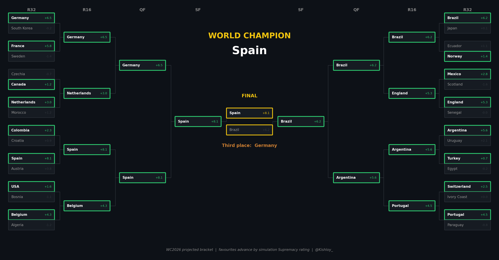
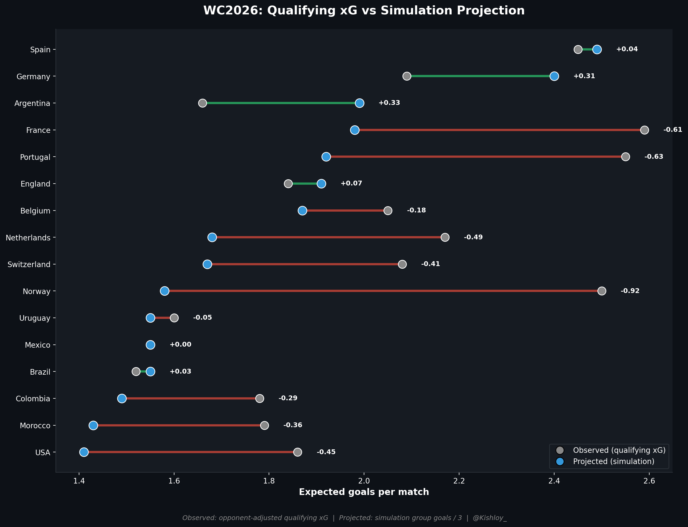
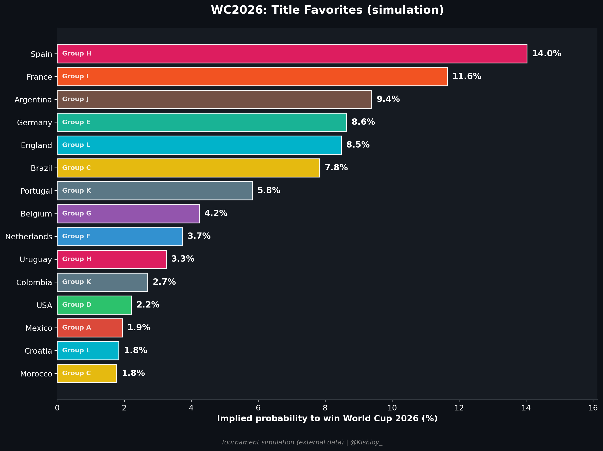
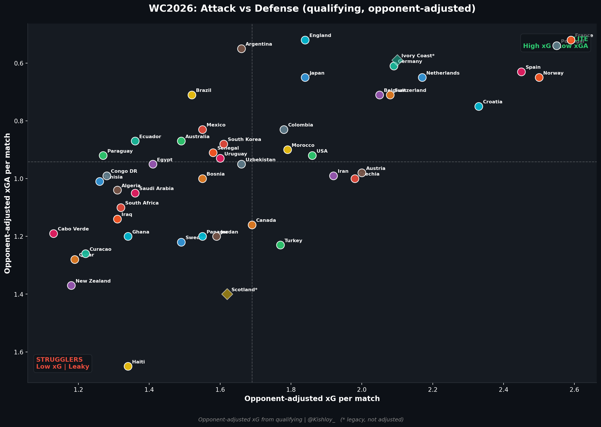

# World Cup 2026: Performance and Projection

A football data project on the 2026 World Cup, built in Python. It looks at the tournament two ways and then compares them.

**Part 1, observed performance.** Opponent-adjusted expected goals (xG) from raw qualifying data, 1025 matches across 46 teams. Raw xG ignores who you played, so I re-based every team against a model of how an average side scores and concedes against an opponent of a given FIFA rank, then put everyone on a neutral schedule. This part is my own analysis.

**Part 2, tournament projection.** Charts built on the output of a Monte Carlo tournament simulation. That simulation data is external and credited below. It gives title odds, a power rating, expected group goals, and group finishing probabilities for all 48 teams.

**Part 3, the bridge.** Where the two disagree. Which teams the projection rates above their actual numbers, and who gets lifted or dragged by their group draw.

## A few of the charts

Projected bracket, run through every round to a champion:

The draw effect, what teams did in qualifying against what the simulation expects at the tournament:

Title favourites:

Opponent-adjusted attack vs defence:

## Built with

Python, pandas, NumPy, matplotlib, Jupyter.

## Running it

Open `wc2026_performance_and_projection.ipynb` in Jupyter and run all cells. The raw data sits inside the notebook, so it rebuilds itself and saves the charts as PNG files.

## Data and credit

The qualifying xG data and the opponent adjustment are my own work. The simulation outputs (title odds, ratings, group probabilities) come from Jamie Davies (https://x.com/jamiedavies02). Full credit to him for the simulation; the qualifying xG work and all visualisation here are mine.
